<div align="center">

# PatrolVision

### AI-Powered Traffic Violation Detection Platform

*Real-time enforcement of traffic laws using computer vision, deep learning, and a live patrol officer companion app.*

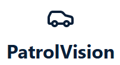

[](https://reactnative.dev/)
[](https://react.dev/)
[](https://nodejs.org/)
[](https://fastapi.tiangolo.com/)
[](https://github.com/ultralytics/ultralytics)
[](https://www.mongodb.com/)

</div>

---

## Table of Contents

- [Overview](#overview)
- [Demo](#demo)
- [System Architecture](#system-architecture)
- [Components](#components)
  - [Mobile App — PatrolVisionApp](#-mobile-app--patrolvisionapp)
  - [AI Model Server](#-ai-model-server)
  - [Backend API Server](#-backend-api-server)
  - [Web Dashboard](#-web-dashboard)
- [Detection Capabilities](#detection-capabilities)
- [Tech Stack](#tech-stack)
- [Getting Started](#getting-started)
- [Project Structure](#project-structure)
- [Screenshots Gallery](#screenshots-gallery)
- [Roadmap](#roadmap)
- [Authors](#authors)

---

## Overview

**PatrolVision** is a complete end-to-end platform that turns any patrol vehicle's smartphone into an intelligent traffic-violation detection system. Officers stream live road footage from their phone — the system analyses every frame with YOLO-based segmentation models, recognises license plates, classifies the violation, persists evidence, and broadcasts events in real time to a central web dashboard.

> **One mission:** make traffic enforcement faster, more accurate, and fully evidence-backed.

<!-- 📸 ADD HERE: Animated GIF of the full pipeline (phone → detection → dashboard alert)
     File location: docs/images/pipeline-demo.gif
     Markdown:  -->

---

## Demo

🎬 **[▶️ Watch the full demo video](docs/videos/demo.mp4)** — see the entire flow from a phone capturing a road violation, to AI inference, to a real-time dashboard alert.

<div align="center">

<a href="docs/videos/demo.mp4">
  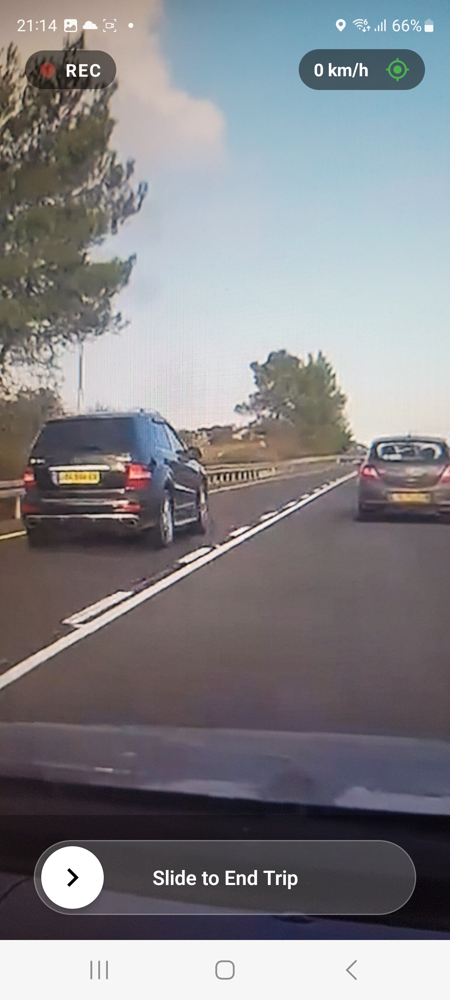
</a>

<sub><i>Click the thumbnail above to play the demo video</i></sub>

</div>

> 💡 If the click-through doesn't auto-play on GitHub, drag `docs/videos/demo.mp4` into the README on github.com's editor — GitHub will replace this section with a native HTML5 player.

---

## System Architecture

```
                                ┌────────────────────────────┐
                                │     📱 Mobile App          │
                                │      (React Native)        │
                                │  Officer / Driver on Road  │
                                └──┬──────────────────────┬──┘
                                   │                      │
              frames batch         │                      │   violation report
              (HTTP multipart)     │                      │   (JSON + image + GPS)
                                   ▼                      ▼
              ┌────────────────────────────┐   ┌────────────────────────────┐         ┌─────────────────────┐
              │      🧠 Model Server       │   │      🗄️ Backend API        │ ◀─────▶ │  🍃 MongoDB Atlas   │
              │   FastAPI + Python Logic   │   │   Express + Node.js + IO   │         └─────────────────────┘
              │       Detect + LPR         │   └─────────────┬──────────────┘
              └────────────────────────────┘                 │
                  returns violation                          │   realtime
                  result back to app                         │   (WebSocket)
                                                             ▼
                                              ┌────────────────────────────┐
                                              │      📊 Web Dashboard      │
                                              │      React + Leaflet       │
                                              │       Command center       │
                                              └────────────────────────────┘
```


---

## Components

### 📱 Mobile App — PatrolVisionApp

A React Native app built for the patrolling officer. The phone becomes the sensor: it captures the road, batches frames, sends them upstream, and surfaces violations the moment they happen.

#### Two modes of operation

The app gives officers **two complementary ways** to analyse the road:

| 📹 Live Camera Mode | 🎞️ Video Analysis Mode |
|---|---|
| **Real-time enforcement.** Stream live road footage from the patrol vehicle's phone. Frames are batched and dispatched to the model server every few seconds, so violations are flagged the moment they happen. | **Post-hoc review.** Pick an existing recording (dash-cam clip, evidence video) from the device and re-run the entire detection pipeline against it. Same logic, same accuracy — perfect for cases where live capture wasn't possible. |
| Powered by `react-native-vision-camera` + GPS tagging | Powered by `react-native-create-thumbnail` + `react-native-video` |

#### Highlights

- **Auth flow** — register / login secured with JWT
- **GPS tagging** — every violation stamped with location via `react-native-geolocation-service`
- **Violations History** — browse, filter, and inspect past evidence
- **Violation Detail** — full-resolution evidence photo, plate, GPS coordinates, timestamp
- **Manual Violation entry** — officers can also file a violation by hand
- **Theming + Splash + Skeleton loaders** for a polished UX
- **Keep-awake** during live capture so the screen never dims mid-patrol

<p align="center">
  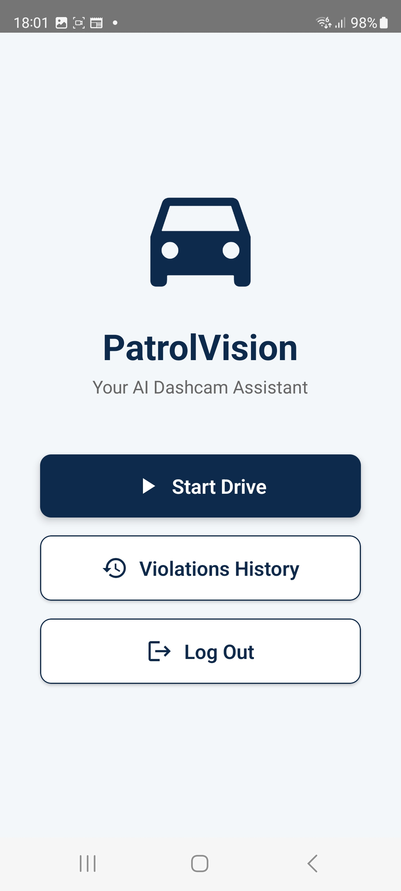
  
  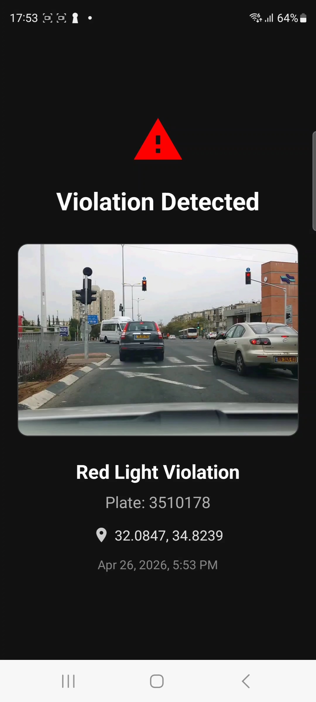
</p>
<p align="center">
  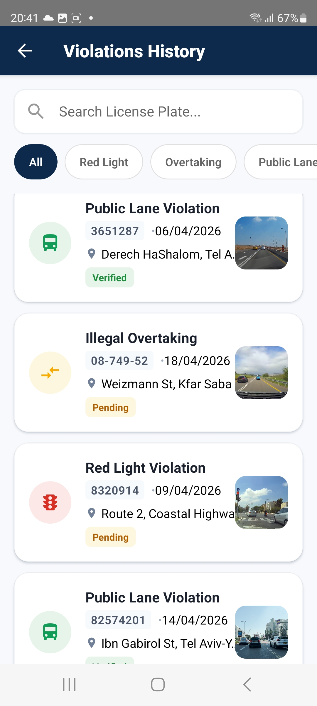
  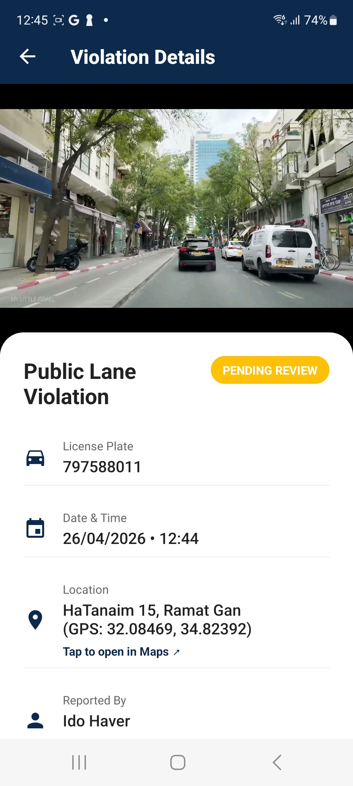
</p>

📁 [PatrolVisionApp/](PatrolVisionApp/)

---

### 🧠 AI Model Server

The brains of PatrolVision. A Python FastAPI service that runs **YOLO segmentation** and **license-plate recognition** models on every batch of frames the phone sends.

> ☁️ **Deployable on Hugging Face Spaces** — the server is designed to run as a Space with GPU acceleration so the mobile app can hit it from anywhere. It also runs locally for development (see [Getting Started](#getting-started)).

**Highlights**
- **Dual-model architecture** — one YOLO instance for `predict()` (all classes + masks), a separate one for `track()` (stable vehicle IDs via ByteTrack). Mixing both on one instance corrupts detections, so they're isolated.
- **Dedicated LPR model** — a second `lpr_model.pt` reads license plates from cropped vehicle regions
- **Three detection logics**, each in its own module:
  - 🟨 [solid_line_detection.py](Model_Server/solid_line_detection.py) — crossing a solid white line
  - 🚌 [bus_lane_detection.py](Model_Server/bus_lane_detection.py) — driving in a dedicated bus lane (with taxi exemption via `taxi_hat` class)
  - 🚦 [red_light_detection.py](Model_Server/red_light_detection.py) — running a red light, with cross-batch memory of approaching vehicles
- **Warm-up phase** on startup compiles the PyTorch graph so the first real batch is fast
- **Debug endpoints** — `/debug_image`, `/debug_violation`, `/debug_plate`, `/debug_first_frame`, `/debug_raw/{idx}` for end-to-end visual diagnostics

<p align="center">
  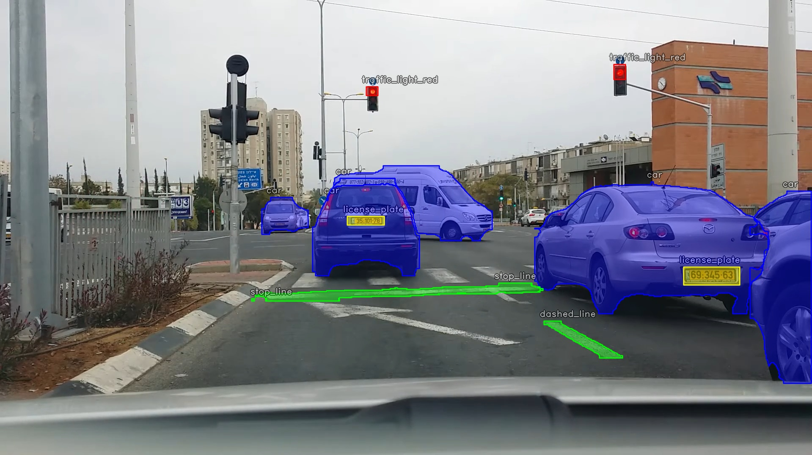
  <br/>
  <sub><i>YOLO segmentation overlay — vehicles, lanes, and traffic lights detected in a single frame</i></sub>
</p>

📁 [Model_Server/](Model_Server/)

---

### 🗄️ Backend API Server

The connective tissue. A Node.js + Express 5 server that handles authentication, persistence, and real-time fan-out to the dashboard.

**Highlights**
- **Auth** — bcrypt + JWT via [routes/auth.js](Server/routes/auth.js)
- **Violations API** — full CRUD, evidence uploads via `multer` ([routes/violation.js](Server/routes/violation.js))
- **MongoDB / Mongoose** — persistent storage of `User` and `Violation` documents
- **Socket.IO server** — pushes new violations to every connected dashboard the moment they're recorded
- **Geocoding** — `node-geocoder` enriches GPS coordinates with human-readable addresses
- **Static evidence hosting** at `/uploads`

📁 [Server/](Server/)

---

### 📊 Web Dashboard

The command center. A React + Vite single-page app for supervisors to monitor the entire fleet of officers in real time.

**Highlights**
- **Live map view** with `react-leaflet` — every violation pinned by GPS coordinates
- **Analytics charts** powered by `recharts` — violation types, trends over time
- **Real-time feed** via `socket.io-client` — new violations appear without refresh
- **Auth-gated dashboard** with `react-router-dom` v7
- **Modern iconography** with `lucide-react`

<p align="center">
  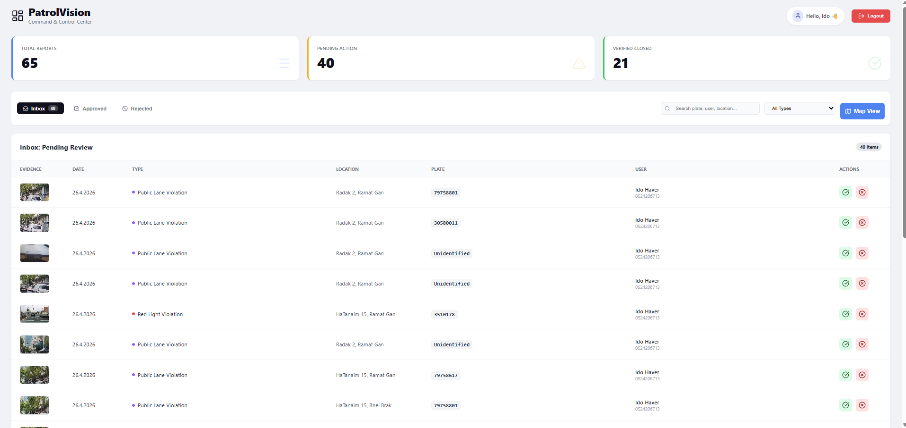
  <br/>
  <sub><i>Live command center — analytics, map, and real-time violation feed</i></sub>
</p>

<p align="center">
  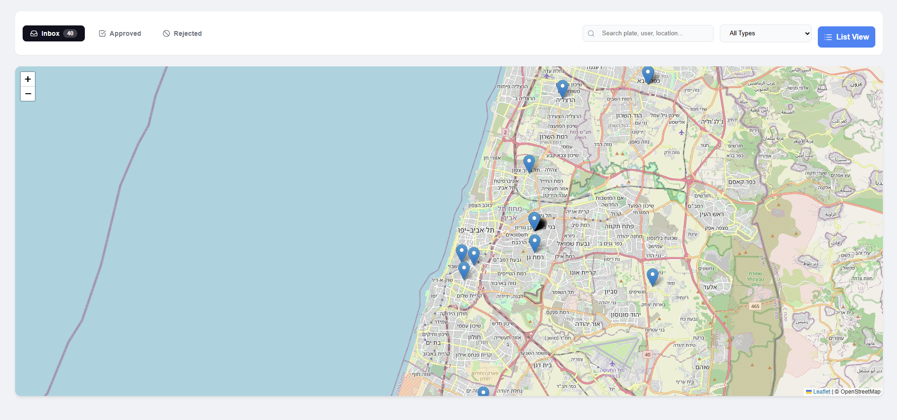
  <br/>
  <sub><i>Interactive Leaflet map — every violation pinned by GPS coordinates</i></sub>
</p>

📁 [WebDashboard/](WebDashboard/)

---

## Detection Capabilities

| 🚨 Violation Type | Detector | What it Catches |
|---|---|---|
| **Solid Line Crossing** | `solid_line_detection.py` | Vehicle whose bounding box crosses a continuous white lane line |
| **Bus Lane Driving** | `bus_lane_detection.py` | Non-taxi vehicles inside a dedicated bus lane (taxis are detected via the `taxi_hat` class and ignored) |
| **Red Light Running** | `red_light_detection.py` | Vehicles crossing the stop line while the traffic light is red — with cross-batch memory for ghost crossings |
| **License Plate Recognition** | `lpr_model.pt` | Reads the plate of any flagged vehicle for evidence |

<p align="center">
  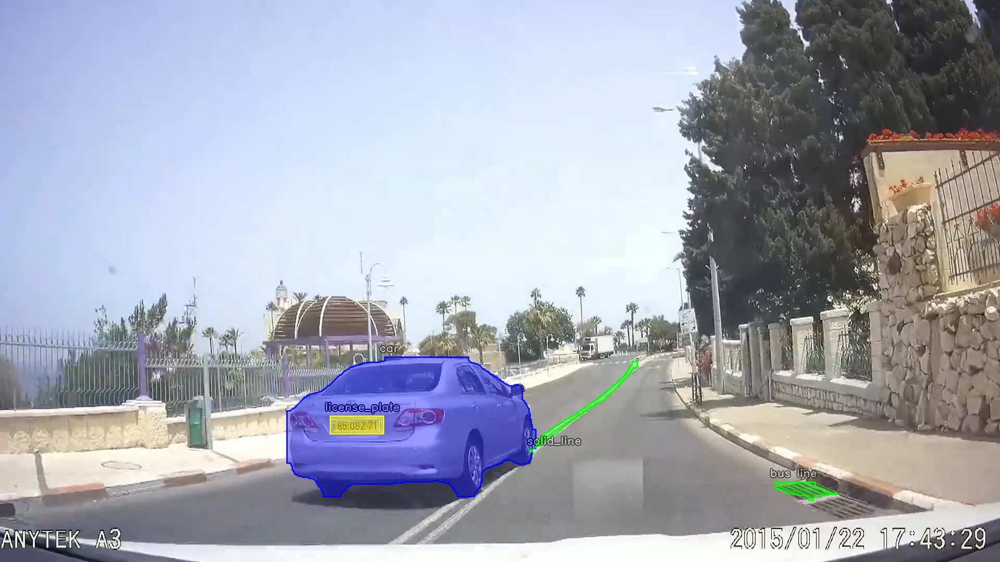
  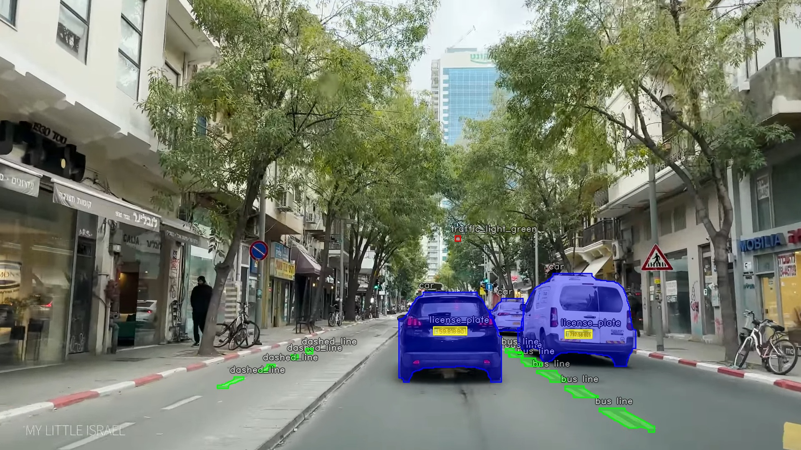
  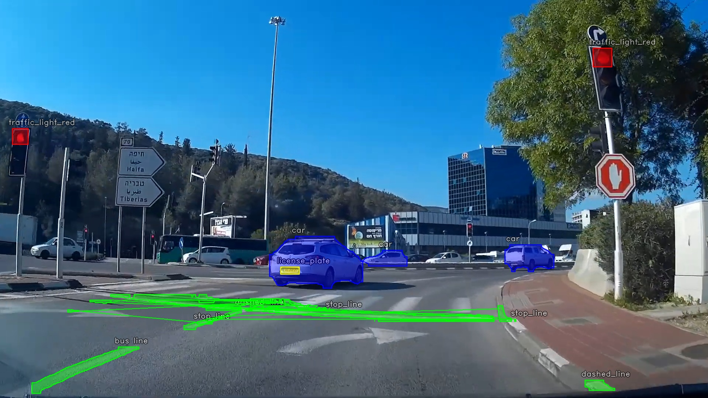
</p>
<p align="center">
  <sub><i>From left to right: solid-line crossing, bus-lane driving, red-light running — each annotated with the model's detection boxes.</i></sub>
</p>

---

## Tech Stack

<table>
<tr>
<td valign="top" width="25%">

**📱 Mobile**
- React Native 0.82
- React 19
- Vision Camera
- React Navigation
- Formik + Yup
- Axios

</td>
<td valign="top" width="25%">

**🧠 Computer Vision**
- Python
- FastAPI + Uvicorn
- Ultralytics YOLO
- OpenCV
- PIL
- ByteTrack

</td>
<td valign="top" width="25%">

**🗄️ Backend**
- Node.js
- Express 5
- MongoDB + Mongoose
- Socket.IO
- JWT + bcrypt
- Multer

</td>
<td valign="top" width="25%">

**📊 Web**
- React 19
- Vite 7
- React Leaflet
- Recharts
- Socket.IO Client
- React Router 7

</td>
</tr>
</table>

---

## Getting Started

### Prerequisites
- Node.js ≥ 20
- Python ≥ 3.10
- MongoDB Atlas connection string (or local MongoDB)
- Android Studio / Xcode for the mobile app

### 1. Clone

```bash
git clone <your-repo-url>
cd PatrolVision
```

### 2. Start the Model Server

```bash
cd Model_Server
pip install -r requirements.txt   # fastapi uvicorn ultralytics opencv-python pillow numpy
python app.py                      # runs on :7860
```

### 3. Start the Backend API

```bash
cd Server
npm install
# create a .env with MONGO_URI, JWT_SECRET, PORT
npm run dev                        # runs with nodemon
```

### 4. Start the Web Dashboard

```bash
cd WebDashboard
npm install
npm run dev                        # Vite dev server
```

### 5. Configure the Mobile App's API endpoints

Before running the app, point it at **your** servers. Open [PatrolVisionApp/src/services/api.js](PatrolVisionApp/src/services/api.js) and update the three URL constants near the top of the file:

```js
// PatrolVisionApp/src/services/api.js
export const SERVER_URL = 'http://<YOUR_BACKEND_HOST>:5000';            // Node backend (LAN IP for dev)
const BASE_URL          = 'http://<YOUR_BACKEND_HOST>:5000/api';        // same host + /api prefix
const FASTAPI_URL       = 'http://<YOUR_MODEL_HOST>:7860/analyze_batch'; // FastAPI model server
```

> 📡 **Tip:** for local development on your LAN, use your computer's IPv4 address (e.g. `192.168.1.35`) — `localhost` won't work because the phone runs on a different host than the backend.

### 6. Run the Mobile App

```bash
cd PatrolVisionApp
npm install
npm run android                    # or: npm run ios
```

---

## Project Structure

```
PatrolVision/
├── Model_Server/              🧠 Python FastAPI + YOLO inference
│   ├── app.py                    Entry point — batch endpoint, debug endpoints
│   ├── solid_line_detection.py   Solid-line violation logic
│   ├── bus_lane_detection.py     Bus-lane violation logic
│   ├── red_light_detection.py    Red-light violation logic
│   ├── traffic_model.pt          YOLO seg model (vehicles, lines, lights)
│   └── lpr_model.pt              License-plate recognition model
│
├── Server/                    🗄️ Node.js + Express API
│   ├── index.js                  App + Socket.IO setup
│   ├── routes/                   auth.js, violation.js
│   ├── controllers/              Business logic
│   ├── models/                   User.js, Violation.js (Mongoose)
│   ├── middleware/               JWT auth, error handling
│   └── uploads/                  Evidence images
│
├── PatrolVisionApp/           📱 React Native mobile app
│   ├── App.tsx
│   └── src/
│       ├── screens/              Login, Home, LiveCamera, VideoAnalysis,
│       │                         ViolationsHistory, ViolationDetail, ...
│       ├── components/           AnalysisResults, SplashScreen, ...
│       ├── navigation/           Stack navigators
│       ├── services/             api.js (axios client)
│       └── theme/                Colors, typography
│
└── WebDashboard/              📊 React + Vite admin dashboard
    └── src/
        ├── pages/                Dashboard.jsx, Login.jsx
        ├── services/             API + socket clients
        └── App.jsx
```

---

## Screenshots Gallery

A consolidated look at every part of the platform.

<table>
<tr>
<td align="center" width="33%"><br/><sub>Mobile · Home</sub></td>
<td align="center" width="33%"><br/><sub>Mobile · Live Camera</sub></td>
<td align="center" width="33%"><br/><sub>Mobile · Violation Detected</sub></td>
</tr>
<tr>
<td align="center"><br/><sub>Mobile · Violations History</sub></td>
<td align="center"><br/><sub>Mobile · Violation Detail</sub></td>
<td align="center"><br/><sub>AI Model · YOLO Detection</sub></td>
</tr>
<tr>
<td align="center"><br/><sub>Violation · Solid Line</sub></td>
<td align="center"><br/><sub>Violation · Bus Lane</sub></td>
<td align="center"><br/><sub>Violation · Red Light</sub></td>
</tr>
<tr>
<td align="center" colspan="2"><br/><sub>Web Dashboard · Overview</sub></td>
<td align="center"><br/><sub>Web Dashboard · Map</sub></td>
</tr>
</table>

---

## Roadmap

- [ ] Multi-officer fleet view on the dashboard
- [ ] Configurable violation thresholds per region
- [ ] Offline buffering on the mobile app
- [ ] Court-ready PDF report export
- [ ] Speed-limit detection
- [ ] Pedestrian crossing detection

---

## Authors

Built as a final-year project at **Bar-Ilan University**.

<div align="center">

| <a href="https://github.com/idohaver7"><br/><sub><b>Ido Haver</b></sub></a> | <a href="https://github.com/sharonlokshin"><br/><sub><b>Sharon Lokshin</b></sub></a> |
|:---:|:---:|
| [@idohaver7](https://github.com/idohaver7) | [@sharonlokshin](https://github.com/sharonlokshin) |


⭐ **If you find this project useful, give it a star!** ⭐

</div>
